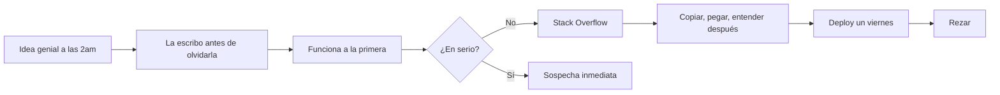

<div align="center">


<br>

</div>

<br><br>

<div align="center">

</div>

<br>

## Sobre mí (MictDev)

<table align="center">
</table>

```swift
struct Milton: Developer {
    let focus: [String] = ["Full Stack", "Mobile", "Cloud", "AI Systems"]
    let philosophy: String = "Simplicity is the ultimate sophistication"
    var currentlyExploring: [String] {
        ["Model Orchestration", "Deep Learning", "System Design"]
    }
}
```

<br>

## Conecta

<p align="center">
<a href="https://www.linkedin.com/in/milton-piña-moreno-626b803a1" target="_blank">

</a>
<a href="mailto:miltonpinamoreno@gmail.com">

</a>
<a href="https://github.com/MilkDev-bit">

</a>
</p>

<p align="center">


</p>

<br>

---

<br>

## Stack Tecnológico

<br>

**Frontend**

<p align="center">


</p>

**Backend**

<p align="center">


</p>

**Mobile**

<p align="center">


</p>

**Bases de datos**

<p align="center">


</p>

**Cloud & DevOps**

<p align="center">


</p>

**Inteligencia Artificial · Deep Learning · Orquestación de Modelos**

<p align="center">


</p>

<br>

---

<br>

## Áreas de Enfoque

<div align="center">

| Desarrollo | Infraestructura | Inteligencia Artificial |
|:---:|:---:|:---:|
| Aplicaciones web y móviles nativas | Arquitecturas cloud en AWS | Orquestación de modelos (LangChain, agentes) |
| APIs REST y microservicios | Administración de sistemas Linux | Deep Learning con PyTorch / TensorFlow |
| Swift & Kotlin para iOS/Android | CI/CD y contenedores con Docker | Integración de LLMs en producción |
| Arquitecturas escalables | Automatización de despliegues | Vector databases & RAG pipelines |

</div>

<br>

## Actividad

<div align="center">

</div>

<br>

---

<br>

## Lo que de verdad importa aquí

<div align="center">
<em>No vendo "buenas prácticas". A menos que paguen bien >-</em>
</div>

<br>

```
$ whoami --skills

> Frontend que no se rompe cuando el cliente cambia de opinión (otra vez)
> Backend que aguanta tráfico sin que yo tenga que rezarle a AWS
> Apps en Swift y Kotlin que no se sienten "portadas", se sienten nativas
> Docker: porque "en mi máquina sí funciona" dejó de ser excusa válida
> Linux en la terminal como quien maneja un auto estándar: con estilo
> LLMs orquestados en pipelines que no alucinan más que yo un lunes
> RAG y vector DBs para que la IA deje de inventar tu API
```

<br>

<div align="center">

**Git commit -m "fix"** — 47 veces en el mismo día, todos sabemos que pasó

**console.log("aquí")** — la deuda técnica más honesta que existe

**"Funciona en mi máquina"** — la frase que separa juniors de seniors con trauma

</div>

<br>


```mermaid
graph LR
    A[Idea genial a las 2am] --> B[La escribo antes de olvidarla]
    B --> C[Funciona a la primera]
    C --> D{¿En serio?}
    D -->|No| E[Stack Overflow]
    D -->|Sí| F[Sospecha inmediata]
    E --> G[Copiar, pegar, entender después]
    G --> H[Deploy un viernes]
    H --> I[Rezar]
```

<br>

---

<br>

<div align="center">

**¿Construyendo algo interesante? Hablemos.**

**miltonpinamoreno@gmail.com**

[Milton Piña Moreno · LinkedIn](https://www.linkedin.com/in/milton-piña-moreno-626b803a1)

<br>


</div>

<br>

<div align="center">

</div>
