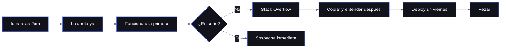

<div align="center">


<br><br>


</div>

<br>

<div align="left">


<br><br>

<p>
<a href="https://www.linkedin.com/in/milton-piña-moreno-626b803a1" target="_blank">

</a>
<a href="mailto:miltonpinamoreno@gmail.com">

</a>
<a href="https://github.com/MilkDev-bit">

</a>
</p>


</div>

<br>

```swift
struct Milton: Developer {
    let focus: [String] = ["Full Stack", "Mobile", "Cloud", "AI Systems"]
    let philosophy: String = "Simplicity is the ultimate sophistication"
    var currentlyExploring: [String] {
        ["Model Orchestration", "Deep Learning", "System Design"]
    }
}
```

<br>


<br><br>

**Frontend**

<p align="center">


</p>

**Backend**

<p align="center">


</p>

**Mobile**

<p align="center">


</p>

**Bases de datos**

<p align="center">


</p>

**Cloud & DevOps**

<p align="center">


</p>

**Inteligencia Artificial · Deep Learning · Orquestación de Modelos**

<p align="center">


</p>

<br>


<br><br>

<div align="center">

| Desarrollo | Infraestructura | Inteligencia Artificial |
|:---|:---|:---|
| Aplicaciones web y móviles nativas | Arquitecturas cloud en AWS | Orquestación de modelos (LangChain, agentes) |
| APIs REST y microservicios | Administración de sistemas Linux | Deep Learning con PyTorch / TensorFlow |
| Swift & Kotlin para iOS/Android | CI/CD y contenedores con Docker | Integración de LLMs en producción |
| Arquitecturas escalables | Automatización de despliegues | Vector databases & RAG pipelines |

</div>

<br>


<br><br>

<div align="center">

</div>

<br>


<br><br>

<div align="center">
<em>No vendo "buenas prácticas". A menos que paguen bien >-</em>
</div>

<br>

```
$ whoami --skills

> Frontend que no se rompe cuando el cliente cambia de opinión (otra vez)
> Backend que aguanta tráfico sin que yo tenga que rezarle a AWS
> Apps en Swift y Kotlin que no se sienten "portadas", se sienten nativas
> Docker: porque "en mi máquina sí funciona" dejó de ser excusa válida
> Linux en la terminal como quien maneja un auto estándar: con estilo
> LLMs orquestados en pipelines que no alucinan más que yo un lunes
> RAG y vector DBs para que la IA deje de inventar tu API
```

<br>


<br>


```mermaid
%%{init: {'theme':'base', 'themeVariables': {'primaryColor':'#12121a','primaryTextColor':'#F5F5F7','primaryBorderColor':'#4C6FFF','lineColor':'#5C5C63','secondaryColor':'#1a1a24','tertiaryColor':'#12121a','fontFamily':'SF Mono, monospace'}}}%%
graph LR
    A[Idea a las 2am] --> B[La anoto ya]
    B --> C[Funciona a la primera]
    C --> D{¿En serio?}
    D -->|No| E[Stack Overflow]
    D -->|Sí| F[Sospecha inmediata]
    E --> G[Copiar y entender después]
    G --> H[Deploy un viernes]
    H --> I[Rezar]
```

<br>

<div align="center">


<br>

**[miltonpinamoreno@gmail.com](mailto:miltonpinamoreno@gmail.com)** · **[Milton Piña Moreno · LinkedIn](https://www.linkedin.com/in/milton-piña-moreno-626b803a1)**

<br>


</div>
