<h1 align="center">
  
</h1>

<p align="center">
  
  
</p>

<div align="center">
  
</div>

<br>

<p align="center">
  <em>Apasionado por crear soluciones tecnológicas innovadoras | Transformando ideas en código escalable y eficiente</em>
</p>

<p align="center">
  <em>Especializado en desarrollo Full Stack, aplicaciones móviles multiplataforma y arquitecturas cloud</em>
</p>

<br>

## Conecta Conmigo

<p align="center">
  <a href="https://www.linkedin.com/in/milton-piña-moreno-626b803a1" target="_blank">
    
  </a>
  <a href="mailto:miltonpinamoreno@gmail.com">
    
  </a>
  <a href="https://github.com/MilkDev-bit">
    
  </a>
</p>

<br>

## Sobre Mí

```typescript
const milton = {
    role: "Full Stack & Mobile Developer",
    location: "🌎",
    currentFocus: ["Cloud Architecture", "Mobile Development", "Microservices"],
    learning: ["AWS Solutions", "DevOps Practices", "System Design"],
    hobbies: ["Coding", "Problem Solving", "Tech Innovation"],
    motto: "Code with passion, build with purpose"
};
```

<br>

## 🛠️ Tech Stack

<details open>
<summary><b>Frontend Development</b></summary>
<br>


</details>

<details open>
<summary><b>Backend Development</b></summary>
<br>


</details>

<details open>
<summary><b>Mobile Development</b></summary>
<br>


</details>

<details open>
<summary><b>Database & ORM</b></summary>
<br>


</details>

<details open>
<summary><b>☁️ DevOps & Cloud</b></summary>
<br>


</details>

<br>


## Contribution Graph

<div align="center">
  
</div>

<br>

## Experiencia Técnica

<div align="center">

| 🎨 Frontend | ⚡ Backend | 📱 Mobile | ☁️ Cloud & DevOps |
|------------|-----------|----------|-------------------|
| React & Vue | Node.js & NestJS | Flutter | Docker & AWS |
| TypeScript | Python & Django | Kotlin | CI/CD Pipelines |
| Responsive Design | RESTful APIs | React Native | Linux Administration |
| State Management | Microservices | Native Development | Cloud Architecture |

</div>

<br>

## Filosofía de Desarrollo

> *"El código limpio no es escrito siguiendo un conjunto de reglas. No puedes convertirte en un artesano de software aprendiendo una lista de heurísticas. El profesionalismo y la artesanía provienen de valores que impulsan las disciplinas."*

```mermaid
graph LR
    A[Idea] --> B[Diseño]
    B --> C[Desarrollo]
    C --> D[Testing]
    D --> E[Deployment]
    E --> F[Monitoring]
    F --> G[Optimization]
    G --> C
```

<div align="center">



</div>

<br>

## Contacto

<div align="center">

**¿Buscas colaborar en un proyecto?** ¡Contáctame!

**Email:** miltonpinamoreno@gmail.com

**LinkedIn:** [Milton Piña Moreno](https://www.linkedin.com/in/milton-piña-moreno-626b803a1)

</div>

<br>

<div align="center">
  
</div>

<p align="center">
  
  
</p>
